*Table 1: Component selection*

## Speaker

| **Solution**                                                                                                                                                                                      | **Pros**                                                                                                                                    | **Cons**                                                                                            |
| ------------------------------------------------------------------------------------------------------------------------------------------------------------------------------------------------- | ------------------------------------------------------------------------------------------------------------------------------------------- | --------------------------------------------------------------------------------------------------- |
|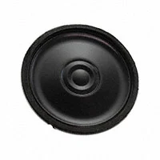
Option 1.  SP-4005Y $2.09/each [link to product](https://www.digikey.com/en/products/detail/soberton-inc/SP-4005Y/9924431)        | \* Inexpensive[^1] \* 88 db output  \*Through hole soldered | \* Requires external components and support circuitry for interface \* Needs special PCB layout. |
|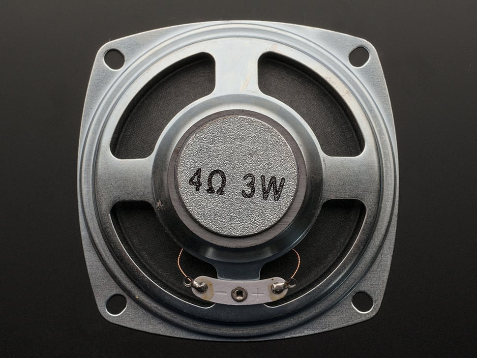
 \* Option 2.  \* Speaker - 3" Diameter - 4 Ohm 3 Watt  \* $1.95/each  \* [Link to product](https://www.adafruit.com/product/1314#description) | \* Cheaper   \* 92 db output | * Larger Size   *Tariff May Apply |
|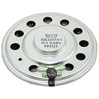
 \* Option 3.  \* Vansonic 50CS08FH-1 Round Ferrite Speaker  \* $0.59/each  \* [Link to product](https://www.jameco.com/z/50CS08FH-1-Vansonic-Round-Ferrite-Speaker-1-94-Diameter-8-ohm-0-4-Watt-200-Hz-to-5-kHz_2328575.html) | \* Cheaper   \* 85 db output | * Sound quality is not good   *Supporting Circuit needed |

**Choice:** Option 3: Vansonic 50CS08FH-1 Round Ferrite Speaker

**Rationale:** We already have a capable speaker we were given in class, which reduces shipping time and is already soldered and ready to plug into the circuit.

## NPN Transistor

| **Solution**                                                                                                                                                                                      | **Pros**                                                                                                                                    | **Cons**                                                                                            |
| ------------------------------------------------------------------------------------------------------------------------------------------------------------------------------------------------- | ------------------------------------------------------------------------------------------------------------------------------------------- | --------------------------------------------------------------------------------------------------- |
|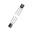
  \*Option 1.  *2N3904   \* $0.14/each [link to product](https://www.digikey.com/en/products/detail/diotec-semiconductor/2N3904/13164701) | \* Inexpensive[^1] \* We already have this.   | \* Requires external components and support circuitry for interface \* 5 week lead time |
|
 \* Option 2.  \* 2N2222A  \* $0.17/each  \* [Link to product](https://www.digikey.com/en/products/detail/diotec-semiconductor/2N2222A/13164037) | \* 60 V 48 Amp   \* 20,239 in stock | * 40 V 600 mA   *more expensive |
|
 \* Option 3.  \* BC550CBU  \* $0.29/each  \* [Link to product](BC550CBU) | \* 45 V 100 mA   \* From OnSemi \ *8,667 in stock|   * No real negatives, except expenisve  |

**Choice:** Option 1

**Rationale:** Because we already have them and have gone through labs using the 2N3904.

## PNP Transistor

| **Solution**                                                                                                                                                                                      | **Pros**                                                                                                                                    | **Cons**                                                                                            |
| ------------------------------------------------------------------------------------------------------------------------------------------------------------------------------------------------- | ------------------------------------------------------------------------------------------------------------------------------------------- | --------------------------------------------------------------------------------------------------- |
|
 \* Option 1.  \* BD140  \* $0.68/each  \* [Link to product](https://www.digikey.com/en/products/detail/stmicroelectronics/BD140/1037683) | \* 6,666 in stock   \* 80 V 1.5 Amp \ *Lowest manufactuerer lead time| * No real negatives, except expensive  |
|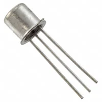
 \* Option 2.  \* 2N2907A  \* $3.61/each  \* [Link to product](https://www.digikey.com/en/products/detail/microchip-technology/2N2907A/279906) | \* 60 V 600 mA   \* 1,288 in stock    \* Microchip is from AZ | *more expensive |
|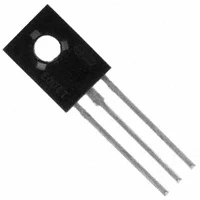
  \*Option 3.  *2N3906   *$0.14/each [link to product](https://www.digikey.com/en/products/detail/diotec-semiconductor/2N3906/22191309)  | \* Inexpensive[^1]  \* 40 V 200 mA   | \* Requires external components and support circuitry for interface \* Needs special PCB layout. |

**Choice:** Option 3

**Rationale:** Because we already have them and have gone through labs using the 2N3906.

## Solenoid Motor

| **Solution**                                                                                                                                                                                      | **Pros**                                                                                                                                    | **Cons**                                                                                            |
| ------------------------------------------------------------------------------------------------------------------------------------------------------------------------------------------------- | ------------------------------------------------------------------------------------------------------------------------------------------- | --------------------------------------------------------------------------------------------------- |
|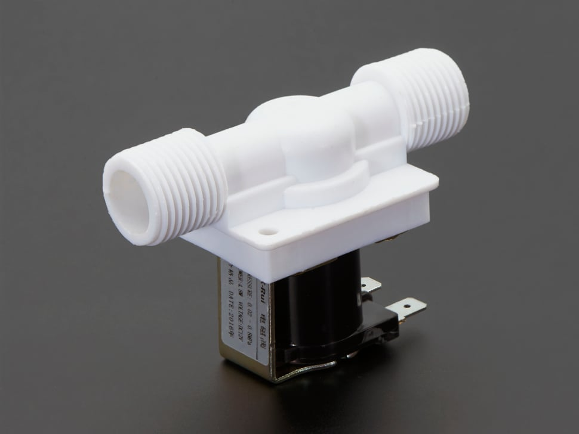
 Option 1.  Plastic Water Solenoid Valve - 12V - 1/2" Nominal  $6.95/each [link to product](https://www.adafruit.com/product/997)                 | \* Inexpensive  \* Compatible with PSoC                                            | \* Requires external components and support circuitry for interface \* Needs special PCB layout. |
|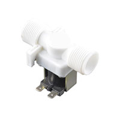
 \* Option 2.  \* 12V Solenoid Valve - 3/4" - 1046  \* $9.62/each  \* [Link to product](https://www.digikey.com/en/products/detail/sparkfun-electronics/10456/5684378) | \* Smaller   \* Operates at 0.2~8 bar | * 0°C ~ 75°C   *Tariff May Apply |
|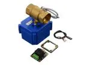
 \* Option 3.  \* DFRobot FIT0617 Solenoid Valve  \* $25/each  \* [Link to product](https://www.mouser.com/ProductDetail/DFRobot/FIT0617?qs=T3oQrply3y%2Fjsecd34PRgA%3D%3D) | \* Direct connection to Microcontroller   \* Valve and DC Motor integrated | * Larger Size   *Estimated 44% Tariff |

**Choice:** Option 3: DFRobot FIT0617 Solenoid Valve

**Rationale:** Because we didn't use most of the budget on the Speaker, I think we can spend some here to get a really plug-and-play solenoid motor that fits directly with the PIC Nano.

## MOSFET

| **Solution**                                                                                                                                                                                      | **Pros**                                                                                                                                    | **Cons**                                                                                            |
| ------------------------------------------------------------------------------------------------------------------------------------------------------------------------------------------------- | ------------------------------------------------------------------------------------------------------------------------------------------- | --------------------------------------------------------------------------------------------------- |
|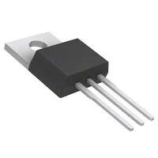
 Option 1.  AOT2618L  $1.66/each [link to product](https://www.digikey.com/en/products/detail/alpha-omega-semiconductor-inc/AOT2618L/3603378)                 | \* Inexpensive[^1] \* Compatible with PSoC                                          | \* Requires external components and support circuitry for interface \* Needs special PCB layout. |
|
 \* Option 2.  \* NDP6060L  \* $2.63/each  \* [Link to product](https://www.digikey.com/en/products/detail/onsemi/NDP6060L/244273) | \* 60 V 48 Amp     \* Onsemi is from AZ |   *more expensive |
|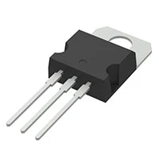
 \* Option 3.  \* STP55NF06  \* $1.47/each  \* [Link to product](https://www.digikey.com/en/products/detail/stmicroelectronics/STP55NF06/603802) | \* Cheapest   \* 60 V 50 Amp \ *Lowest manufactuerer lead time|   * No real negatives  |

**Choice:** Option 3

**Rationale:** In between 3 and 1 because option 1 I already have and do not need to wait, but option 3 might just be better overall in terms of price and functionality. All in all, Option 1 is the easiest because I already have it on hand. However, option 1 is not available right now, so option 3 is better.

## Voltage Regulator

| **Solution**                                                                                                                                                                                      | **Pros**                                                                                                                                    | **Cons**                                                                                            |
| ------------------------------------------------------------------------------------------------------------------------------------------------------------------------------------------------- | ------------------------------------------------------------------------------------------------------------------------------------------- | --------------------------------------------------------------------------------------------------- |
|
   Option 1 .  *L7805CV  $0.50/each [link to product](https://www.digikey.com/en/products/detail/stmicroelectronics/L7805CV/585964)                 | \* Inexpensive[^1] \* We already have these  | \* Requires external components and support circuitry for interface \* Needs special PCB layout. |
|
 \* Option 2.  \*LM317T   \* $0.56/each  \* [Link to product](https://www.digikey.com/en/products/detail/stmicroelectronics/LM317T/591677) | \* Complete series of protection   \* Output current in excess 1.5A  \* 1.2 - 37 V |   *more expensive |
|
 \* Option 3.  \*MC7805CTG   \* $0.52/each  \* [Link to product](https://www.digikey.com/en/products/detail/onsemi/MC7805CTG/919333) | \* No external components required   \* 5 V 1 Amp   \*OnSemi is in AZ | * No real negatives, just 2 cents more expensive  |

**Choice:** Option 1 

**Rationale:** Because we already have them in hand and have experimented with the LM7805 in previous class labs, there is no real reason to switch on it now.

## Power Source

| **Solution**                                                                                                                                                                                      | **Pros**                                                                                                                                    | **Cons**                                                                                            |
| ------------------------------------------------------------------------------------------------------------------------------------------------------------------------------------------------- | ------------------------------------------------------------------------------------------------------------------------------------------- | --------------------------------------------------------------------------------------------------- |
|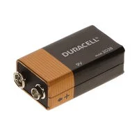
 Option 1.  *9V Duracell Battery   $4.82/each [link to product](https://www.digikey.com/en/products/detail/duracell-industrial-operations-inc/9V/21259959)   | \* Inexpensive[^1]   | \* Requires external components and support circuitry for interface \* Needs special PCB layout to supprt battery. |
|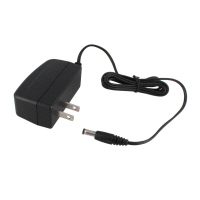
 \* Option 2.   \*WR9HD1333CCP-F(R6B)   \* $6.23/each  \* [Link to product](https://www.digikey.com/en/products/detail/globtek-inc/WR9HD1333CCP-F-R6B/13245472) | \* Wall plug in   \* 9V 1.3 A | *more expensive |
|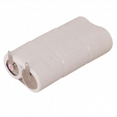
 \* Option 3.  \*LR14XWA/BL3X2   \* $13.47/each  \* [Link to product](https://www.digikey.com/en/products/detail/panasonic-energy/LR14XWA-BL3X2/2043779) | \* Doesnt need to plug into wall   \* 9V \ * Rechargable|   * Expensive  |

**Choice:** Option 2

**Rationale:** Because as a team we decided to share power from one board, and it was already decided we would use a 9V source from the wall, then we would use Voltage regulators to allow each board to receive 5V.

## Table for Selected Components
| Part | Option # |
|---|:---:|
| Speaker | 3 |
| PNP Transistor |  |
| NPN Transistor |  |
| Solenoid Motor | 3 |
| MOSFET | 3 |
| Voltage Regulator | 1 |
| Power Source | 2 |

## MCC Configuration

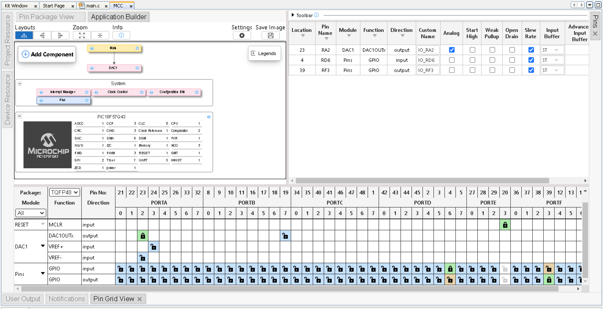

