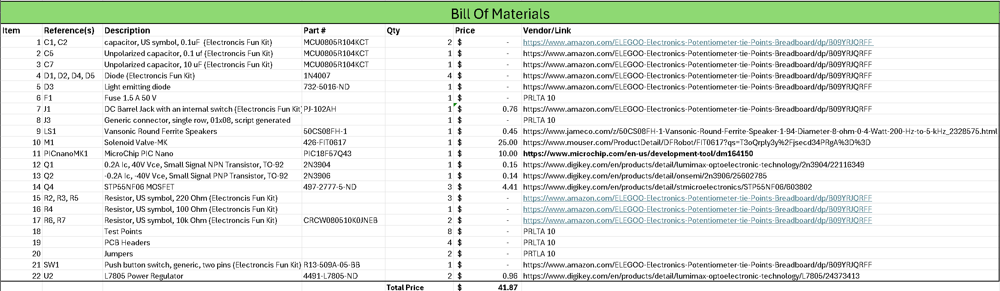

## Overview
The *Bill of Materials* is the main organization tool and record keeping list of all components needed for the PCB. It contains the price and purchase links to each component selected from the [Component Selection](https://mjkim21-dev.github.io/02-Component-Selection/Component-Selection/) page.

## Bill of Materials (as Image)

**Figure 1:** Bill of Materials as a screenshot.

