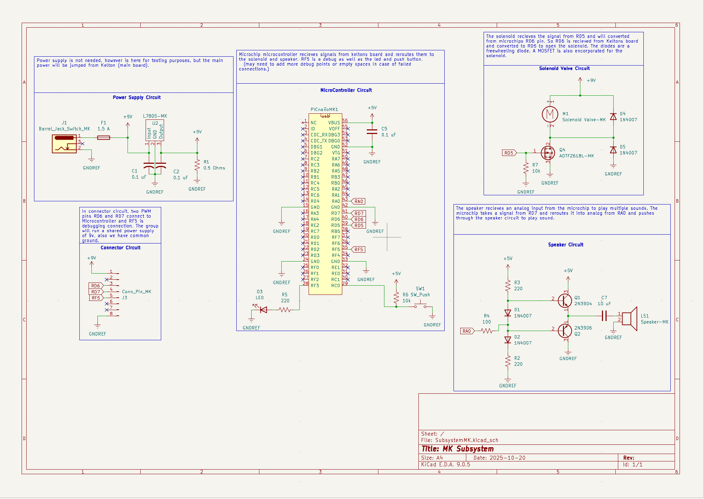

## Overview

This schematic is designed to support a solenoid valve, PIC Nano microcontroller, and a speaker circuit.

{style width:"350" height:"300;"} 
**Figure 1:** Showing current schematic.

## Resouces

The schematic as a PDF download is available [*here*](SubsystemMK.pdf), and the Zip folder of the project [*here*](SubsystemMk-2.zip).
