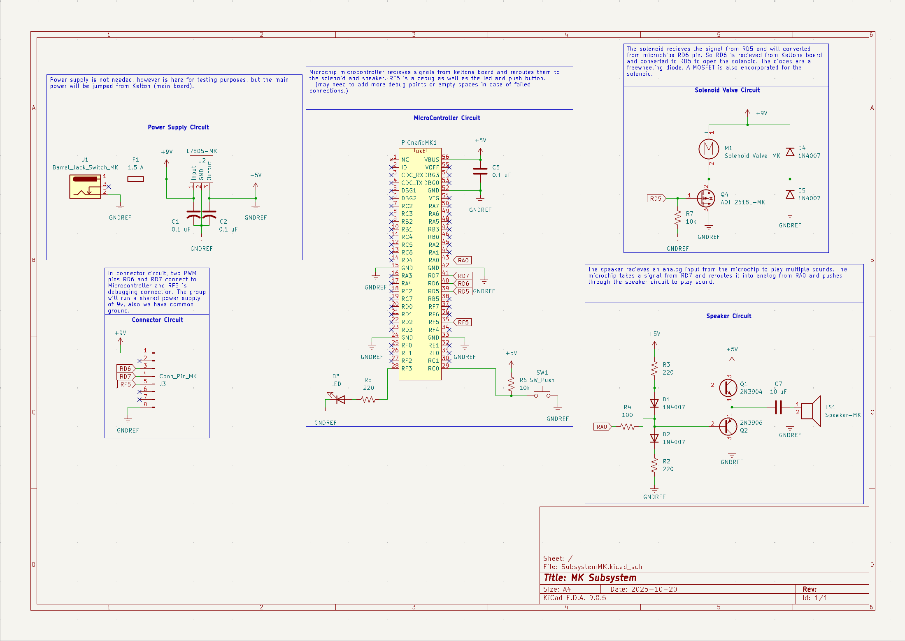

## Overview

This schematic is designed to support a solenoid valve, PIC Nano MicroChip microcontroller, and a speaker circuit.

## Schematic

 
**Figure 1:** Showing Michael's Subsystem

## PCB

 
**Figure 2:** Showing Michael's Subsystem in PCB 

## Resources
The schematic, available as a PDF download, is [*here*](SubsystemMK.pdf), and the project zip folder is [*here*](SubsystemMK-4.zip).

The PCB, available as a download, in the project zip folder is [*here*](.zip).
