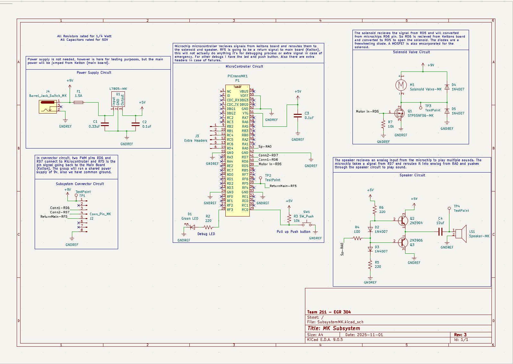

## Overview

This schematic is designed to support a solenoid valve, PIC Nano MicroChip microcontroller, and a speaker circuit.

## Schematic

 
**Figure 1:** Showing Michael's Subsystem

## Resources
The schematic, available for download as a PDF, can be found [*here*](SubsystemMK.pdf). The project zip folder is also available [*here*](SubsystemMK_2.zip).

