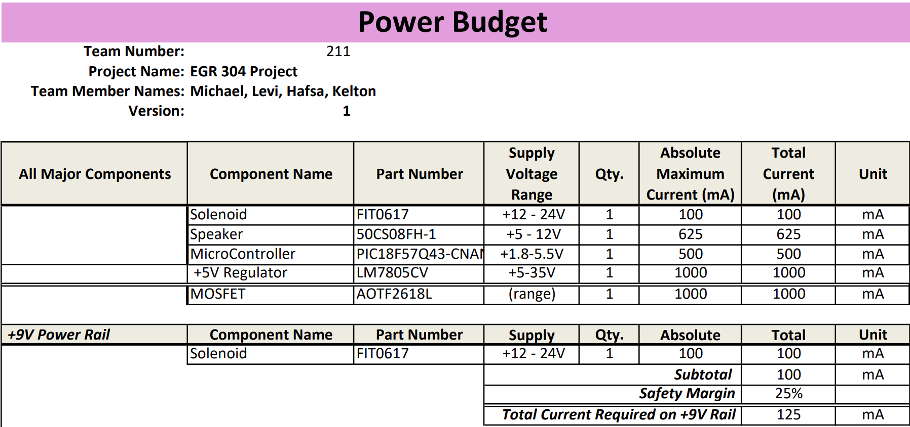
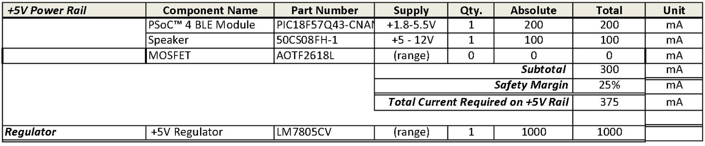
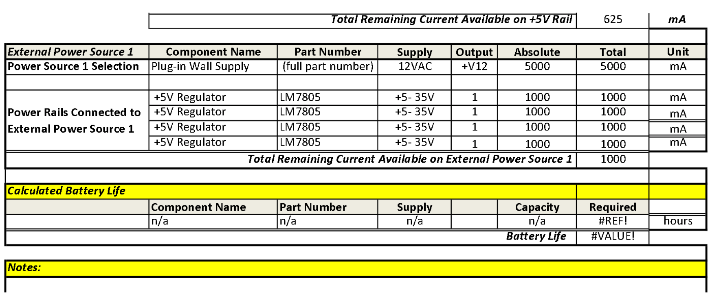

## Overview
The power budget is a spreadsheet that outlines the workflow for the power required by my circuit. It displays all of my major components and ensures I have sufficient power to utilize them all.

> Capture your power budget as an image to display. Take time to get clean breaks and a well-organized layout.

{style width:"350" height:"300;"} 

{style width:"350" height:"300;"}

{style width:"350" height:"300;"}

## Conclusions

From my Power Budget, We have concluded that using a 12V 5A source might be the best plan. Also, as a group, we have decided to share this 12V source through our connector pins and regulate it on each board.

## Resouces

The power budget as a PDF download is available [*here*](PowerBudgetMK.pdf), and a Microsoft Excel Sheet [*here*](PowerBudgetMK.xlsx).
