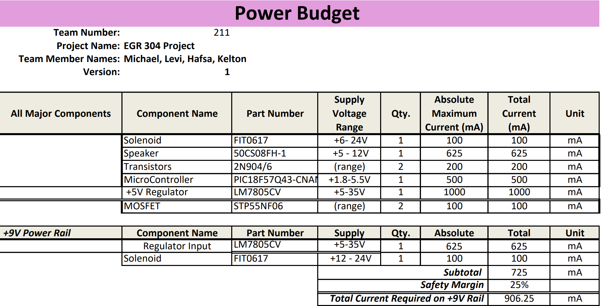
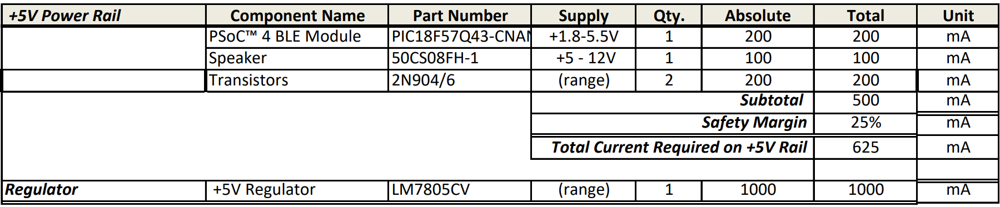
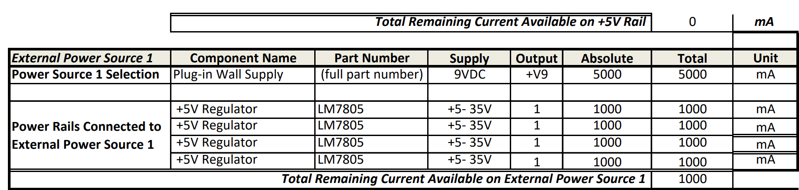

## Overview
The power budget is a spreadsheet that outlines the workflow for the power required by my circuit. It displays all of my major components and ensures I have sufficient power to utilize them all.

## Power Budget Ratings

## Conclusions

From my Power Budget, We have concluded that using a 9V 5A source might be the best plan. Also, as a group, we have decided to share this 9V source through our connector pins and regulate it on each board.

## Resouces

The power budget is available as a PDF download [*here*](PowerBudgetMK2.pdf) and as a Microsoft Excel Sheet [*here*](PowerBudgetMK2.xlsx).
