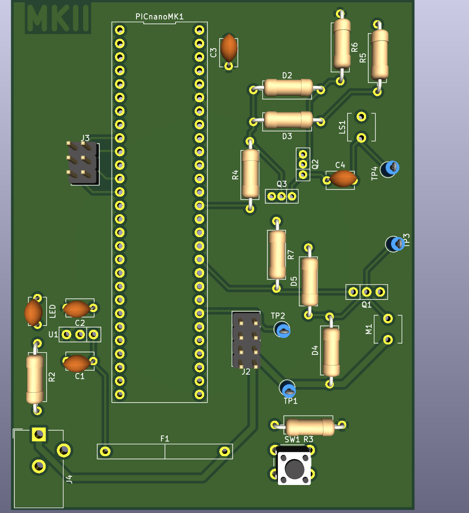

## Overview

This PCB is designed to support a solenoid valve, PIC Nano MicroChip microcontroller, and a speaker circuit.

## Schematic

 
**Figure 1:** Showing Michael's Subsystem PCB Front

 
**Figure 2:** Showing Michael's Subsystem PCB Rear
## Resources
The PCBs project zip folder is a downloadable zip file [*here*](.zip).

