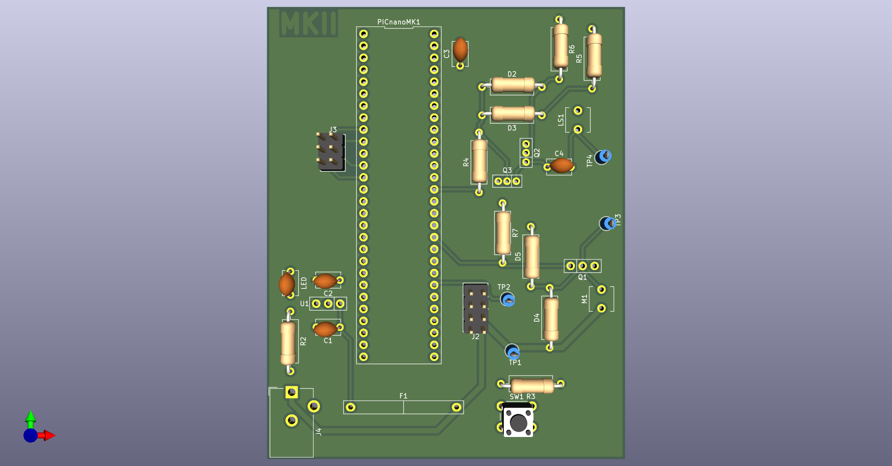
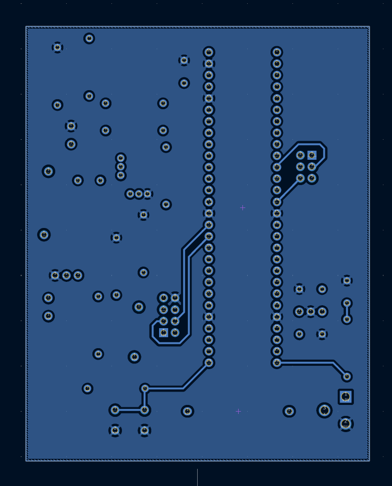

## Overview

This PCB is designed to support a solenoid valve, PIC Nano MicroChip microcontroller, and a speaker circuit. The PCB design is imperative for the project in EGR 304; this is just one of 4 PCB boards. My group mates of Team 211 will have the other boards. The boards will work in a hub and spoke system, see [team block diagram](https://egr304-2025-f-211.github.io/06-Team-block-diagram/) for more information about each boards and where this board fits.

## PCB 3D View

 

**Figure 1:** Showing Michael's Subsystem PCB Front

**Figure 2:** Showing Michael's Subsystem PCB Rear

## Resources
The PCBs project zip folder can be found on the [*Schematic page*](https://mjkim21-dev.github.io/04-Schematic/schematic/). The PCBs PDF file, containing images of both top and bottom layers, can be found [*here*](PCBLayers3.pdf). Finally, the PCBs Gerber files can be found [*here*](MichaelKim211.zip).

