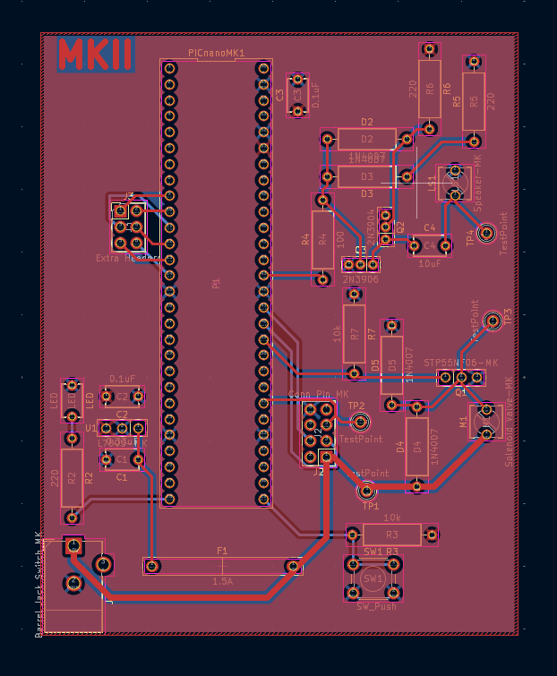
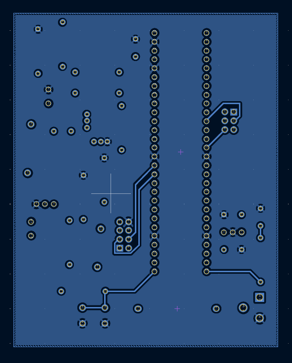

## Overview

This PCB is designed to support a solenoid valve, PIC Nano MicroChip microcontroller, and a speaker circuit.

## PCB 3D View

 
**Figure 1:** Showing Michael's Subsystem PCB Front

 
**Figure 2:** Showing Michael's Subsystem PCB Rear
## Resources
The PCBs project zip folder is a downloadable zip file [*here*](MichaelKim211.zip). The PCBs pdf file containing top and bottom layers can be found [*here*](PCBLayers.pdf). Then the PCBs Gerber files can be found [*here*](GerberZIP.zip).

