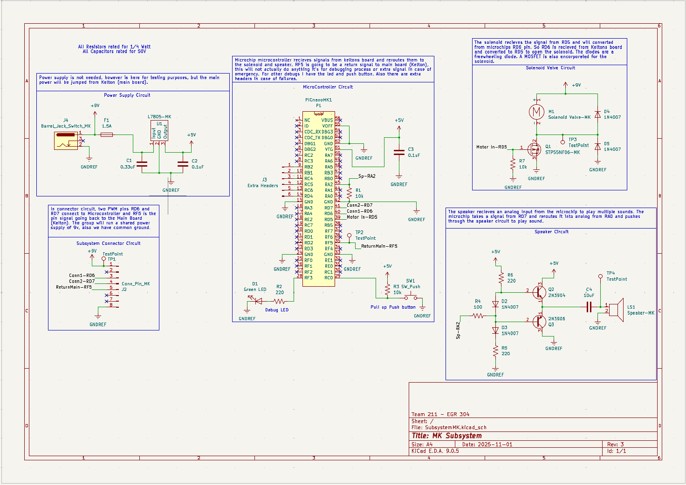
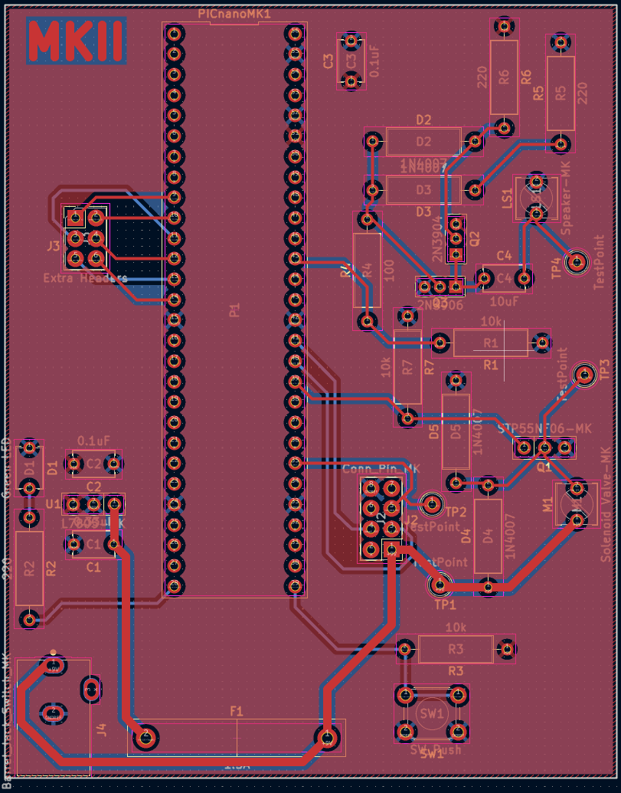
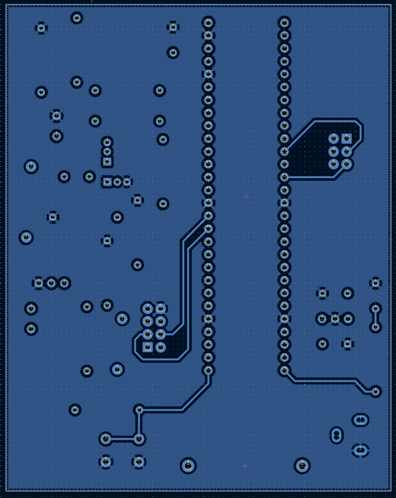

## Overview
Now my design is not perfect, and I've encountered some issues, so I'd like to talk about them here.

As for the schematic, I've added R1, which is a pull-down resistor on pin RD6. Other than that, no major updates. For the PCB, both of my circuits were fully supported. For the speaker, I changed the original input RA0 to RA2 to fit a DAC. For the motor, the solenoid has 3 wires a "Open, Close, and Neutral," so I have to change the schematic and footprint to support that. Still, the schematic can accommodate a standard 9V brushless DC motor. Below are images for version 2.0 of this design. It includes updated traces, increased in size to allow the voltage regulator to maintain a proper 9V flow to convert to 5V. **All project files in the other sections have been updated with these changes, so if the board is ever remade, it is correct.**

**Updated Schematic**
 

**Figure 1:** Showing Manufactured Board Skeloton

**Updated PCB**

 

**Figure 2:** Updated Top Side of PCB

 

**Figure 3:** Updated Bottom Side of PCB

**Updated BOM**

 

**Figure 2:** Updated BOM

This is all for now, and I plan to get better at making PCBs as I progress through the EGR classes here at ASU.
For hyperlinks to the updated files: [KiCAD Project](FinalSubsystemMK.zip) and [Drill Files](MichaelKim211-8). 

Regards,  
Michael Kim
