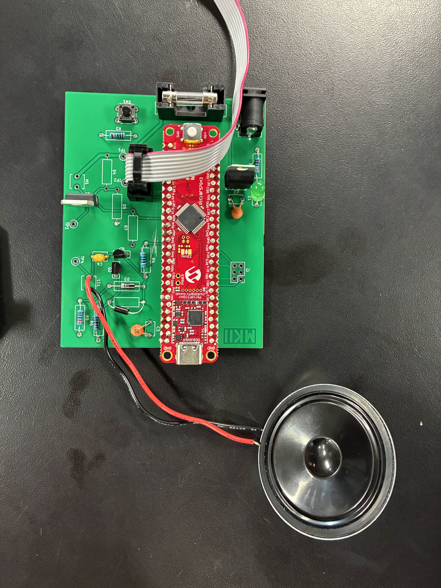

## Overview
Now my design is not perfect, and I've encountered some issues, so I'd like to talk about them here.

As for the schematic, I've added R1, which is a pull-down resistor on pin RD6. Other than that, no major updates. For the PCB, both of my circuits were fully supported, as for the speaker, I changed the original input RA0 to RA2 to fit a DAC. For the motor, the solenoid has 3 wires a "Open, Close, and Neutral," so I have to change the schematic and footprint to support that. Still, the schematic can accommodate a standard 9V brushless DC motor. Below, I have included images for version 2.0 of this design, it has updated traces and a schematic to accommodate all changes. **All project files in the other sections have been updated with these changes, so if the board is ever remade, it is correct.**

**Updated Schematic**

**Updated PCB**

 

**Figure 1:** Showing Manufactured Board Skeloton

 

**Figure 2:** Showing Manufactured Board Soldered

This is all for now, and I plan to get better at making PCBs as I progress through the EGR classes here at ASU.

Regards,  
Michael Kim
