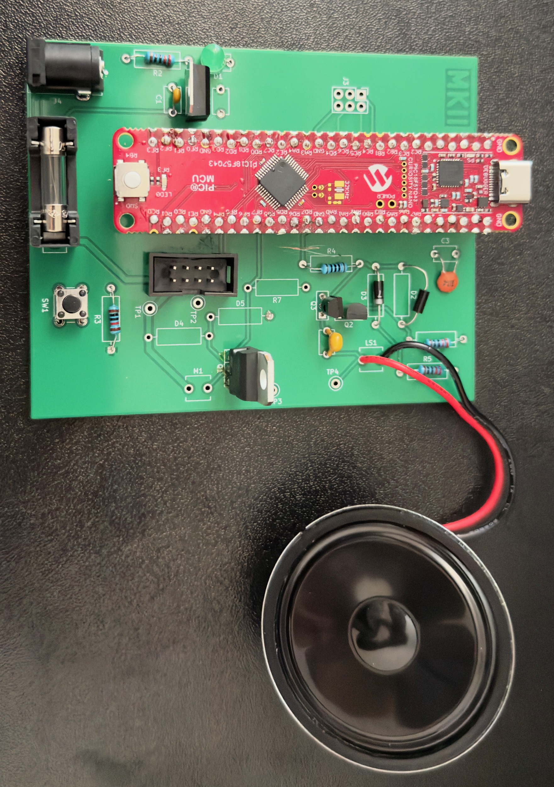

EGR 304 (Michael Kim) Datasheet 
as part of 
 Automated Plant Irrigation System 
for 
 Team 211  

**Submission: December 08, 2025**

## Introduction
This website holds all the data and processes from my individual part of the EGR 304 M/W 1:30 pm section of Team 211. The main team project aims to assist homeowners with plant care, so my system is designed to complement the motor and speakers used in the team project.

### Project Summary
For the project, my board includes a Solenoid valve and a Speaker system, so I am supposed to receive two signals (both digital) from the main board. One digital signal goes to the speaker; however, I then run a DAC to allow for more diverse sounds and alarms. The other digital signal will open the solenoid. You can read more from the [team report](https://egr304-2025-f-211.github.io/).

### My Contribution 

For the team component, I was one of the subsystems of the main board. I was responsible for the design and creation of the solenoid and speaker system. Everything from the design and creation of this subsystem was from me.

To review the details of the data sheet, hyperlinks are provided below:  
[1. Block Diagram](https://mjkim21-dev.github.io/01-Block-Diagram/Block-Diagram/)   
[2. Component Selection](https://mjkim21-dev.github.io/02-Component-Selection/Component-Selection/)   
[3. BOM](https://mjkim21-dev.github.io/03-BOM/BOM/)   
[4. Schematic](https://mjkim21-dev.github.io/04-Schematic/schematic/)   
[5. Power Budget](https://mjkim21-dev.github.io/05-Power-Budget/Power-Budget/)   
[6. PCB Design](https://mjkim21-dev.github.io/06-PCB-Design/pcb/)   
[7. Microcontroller Code](https://mjkim21-dev.github.io/07-Microcontroller%20Code/code/)  
[8. Hardware v2.0](https://mjkim21-dev.github.io/Hardware%20V2.0/) 

